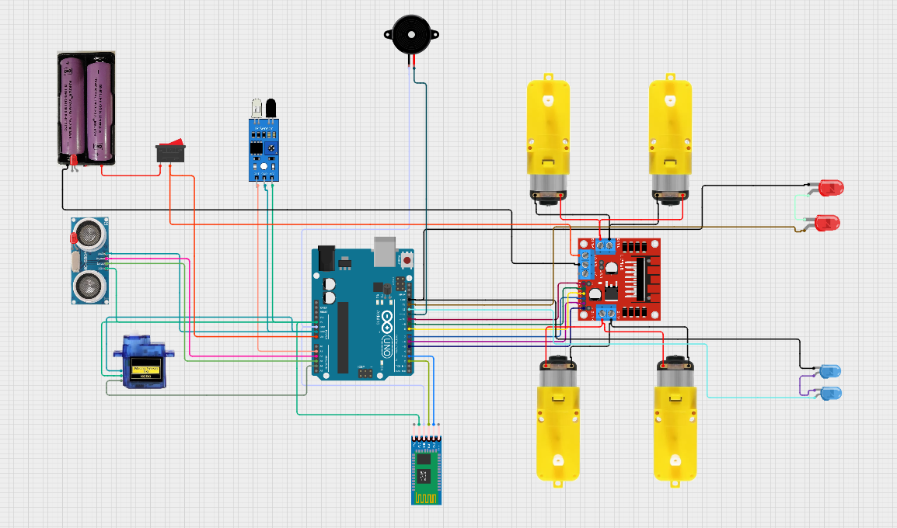

# Arduino Multifunctional Car 🚗🤖

A feature-rich Arduino-powered smart car with **three modes of operation**:  
- 📱 **Bluetooth Remote Control**  
- 🚧 **Obstacle Avoiding (Auto Mode)**  
- 🎤 **Voice Control** (works via Bluetooth same as manual)

This project combines Arduino, sensors, motors, and LEDs to make a multifunctional car with extra safety and fun features.

---

## 🔧 Hardware Used
- Arduino Uno R3
- L298N Motor Driver
- Ultrasonic Sensor (HC-SR04)  
- Bluetooth Module (HC-05)  
- Servo Motor (for ultrasonic sensor rotation)  
- IR Sensor (cliff detection)  
- DC Motors + Wheels  
- Car chassis  
- LEDs (front, back, red, blue)  
- Buzzer (for horn)  
- Battery Pack  
- Jumper wires  

---

## 💻 Software
- Arduino IDE  
- C++ (Arduino sketches)  
- Android app for Bluetooth & Voice Control  

---

## 🚀 Features
- **Bluetooth Remote Control** → Drive the car using a smartphone app.  
- **Obstacle Avoiding Mode** → Automatically detects and avoids obstacles.  
- **Voice Control Mode** → Control movements via voice commands over Bluetooth.  
- **Headlights & Backlights** → Toggle ON/OFF remotely.  
- **VIP Mode** → Red/Blue police lights pattern.  
- **Horn** → Manual horn + Auto reverse horn when moving backward.  
- **Cliff Detection** → Safety stop at edges.  

---

## 🎮 Controls (via Bluetooth / Voice Commands)
| Command | Function |
|---------|---------|
| `A` | Auto Mode (Obstacle Avoiding) |
| `M` | Manual Mode (Bluetooth / Voice) |
| `I` | Idle Mode (Stop) |
| `F` | Move Forward |
| `B` | Move Backward |
| `L` | Turn Left |
| `R` | Turn Right |
| `S` | Stop |
| `H` | Horn |
| `X` | Toggle Front Light |
| `Y` | Toggle Back Light |
| `V` | VIP Mode (auto-off after 5 sec) |

---

## 📸 Images / Videos

Example:  
  
  

---

## 🛠️ Setup
1. Upload the `.ino` file to your Arduino board.  
2. Connect hardware according to the wiring diagram.  
3. Pair your phone with the HC-05 Bluetooth module.  
4. Use a Bluetooth controller app or voice command app to send commands.  
5. Select your mode and enjoy driving your multifunctional car!  

---

## 🤝 Contribution
Feel free to fork this repo, improve features, or add new functionalities.  

---

## 📜 License
This project is licensed under the MIT License.
